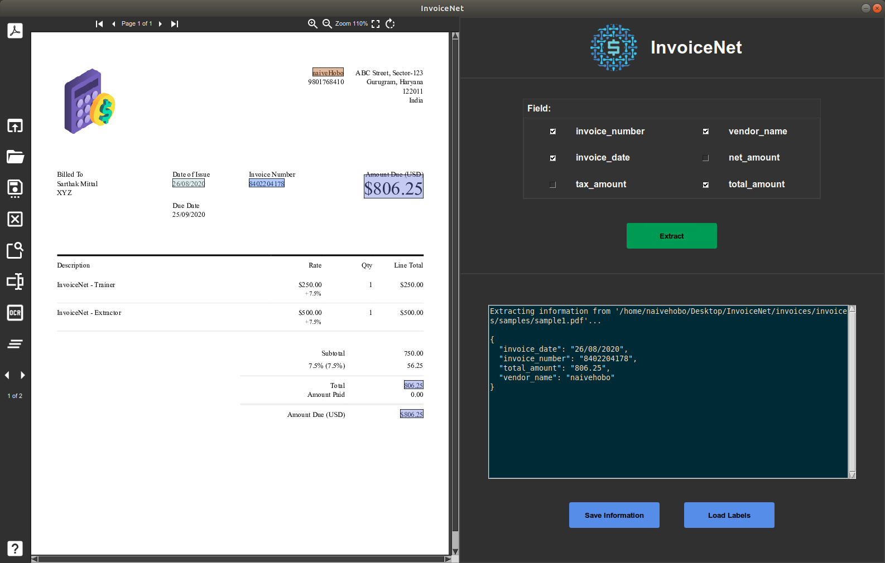
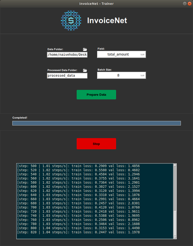

--------------------------------------------------------------------------------

Deep neural network to extract intelligent information from invoice documents.

**TL;DR**

* An easy to use UI to view PDF/JPG/PNG invoices and extract information.
* Train custom models using the Trainer UI on your own dataset.
* Add or remove invoice fields as per your convenience.
* Save the extracted information into your system with the click of a button.

:star: We appreciate your star, it helps!


---



---


---

## Installation

#### Ubuntu 18.04

To install InvoiceNet on Ubuntu 18.04, run the following commands:

```bash
git clone https://github.com/naiveHobo/InvoiceNet.git
cd InvoiceNet/

# Run installation script
./install.sh
```

The install.sh script will install all the dependencies, create a virtual environment, and install InvoiceNet in the virtual environment.

To be able to use InvoiceNet, you need to source the virtual environment that the package was installed in.

```bash
# Source virtual environment
source env/bin/activate
```

#### Windows 10

The recommended way is to install InvoiceNet along with its dependencies in an Anaconda environment:

```bash
git clone https://github.com/naiveHobo/InvoiceNet.git
cd InvoiceNet/

# Create conda environment and activate
conda create --name invoicenet python=3.7
conda activate invoicenet

# Install InvoiceNet
pip install .

# Install poppler
conda install -c conda-forge poppler
```

Some dependencies also need to be installed separately on Windows 10 before running InvoiceNet:

- [Tesseract 5.0.0](https://github.com/UB-Mannheim/tesseract/wiki)
- [ImageMagick 7.0.10](https://imagemagick.org/script/download.php#windows)
- [Ghostscript 9.52](https://www.ghostscript.com/download/gsdnld.html)


## Data Preparation
The training data must be arranged in a single directory. The invoice documents are expected be PDF files and each invoice is expected to have a corresponding JSON label file with the same name. Your training data should be in the following format:

```
train_data/
    invoice1.pdf
    invoice1.json
    nike-invoice.pdf
    nike-invoice.json
    12345.pdf
    12345.json
    ...
```

The JSON labels should have the following format:
```
{
 "vendor_name":"Nike",
 "invoice_date":"12-01-2017",
 "invoice_number":"R0007546449",
 "total_amount":"137.51",
 ... other fields
}
```

To begin the data preparation process, click on the "Prepare Data" button in the GUI or follow the instructions below if you're using the CLI.


## Add Your Own Fields
To add your own fields to InvoiceNet, open **invoicenet/\_\_init\_\_.py**.

There are 4 pre-defined field types:
- **FIELD_TYPES["general"]** : General field like names, address, invoice number, etc.
- **FIELD_TYPES["optional"]** : Optional fields that might not be present in all invoices.
- **FIELD_TYPES["amount"]** : Fields that represent an amount.
- **FIELD_TYPES["date"]** : Fields that represent a date.

Choose the appropriate field type for the field and add the line mentioned below.

```python
# Add the following line at the end of the file

# For example, to add a field total_amount
FIELDS["total_amount"] = FIELD_TYPES["amount"]

# For example, to add a field invoice_date
FIELDS["invoice_date"] = FIELD_TYPES["date"]

# For example, to add a field tax_id (which might be optional)
FIELDS["tax_id"] = FIELD_TYPES["optional"]

# For example, to add a field vendor_name
FIELDS["vendor_name"] = FIELD_TYPES["general"]
```


## Using the GUI
InvoiceNet provides you with a GUI to train a model on your data and extract information from invoice documents using this trained model




Run the following command to run the trainer GUI:

```bash
python trainer.py
```

Run the following command to run the extractor GUI:

```bash
python extractor.py
```

You need to prepare the data for training first. 
You can do so by setting the **Data Folder** field to the directory containing your training data and the clicking the **Prepare Data** button.
Once the data is prepared, you can start training by clicking the **Start** button.


## Using the CLI

### Training 

Prepare the data for training first by running the following command:
```bash
python prepare_data.py --data_dir train_data/
```

Train InvoiceNet using the following command:
```bash
python train.py --field enter-field-here --batch_size 8

# For example, for field 'total_amount'
python train.py --field total_amount --batch_size 8
```

---

### Prediction

---

#### Single invoice
To extract a field from a single invoice file, run the following command:

```bash
python predict.py --field enter-field-here --invoice path-to-invoice-file

# For example, to extract field total_amount from an invoice file invoices/1.pdf
python predict.py --field total_amount --invoice invoices/1.pdf
```

---

#### Multiple invoices
For extracting information using the trained InvoiceNet model, you just need to place the PDF invoice documents in one directory in the following format:

```
predict_data/
    invoice1.pdf
    invoice2.pdf
    ...
```

Run InvoiceNet using the following command:
```bash
python predict.py --field enter-field-here --data_dir predict_data/

# For example, for field 'total_amount'
python predict.py --field total_amount --data_dir predict_data/
```
---

## Reference
This implementation is largely based on the work of R. Palm et al, who should be cited if this is used in a scientific publication (or the preceding conference papers):

[1] Palm, Rasmus Berg, Florian Laws, and Ole Winther. **"Attend, Copy, Parse End-to-end information extraction from documents."** 2019 International Conference on Document Analysis and Recognition (ICDAR). IEEE, 2019.

```bibtex
@inproceedings{palm2019attend,
  title={Attend, Copy, Parse End-to-end information extraction from documents},
  author={Palm, Rasmus Berg and Laws, Florian and Winther, Ole},
  booktitle={2019 International Conference on Document Analysis and Recognition (ICDAR)},
  pages={329--336},
  year={2019},
  organization={IEEE}
}
```

### Note
An implementation of an inferior (also slightly broken) invoice handling system based on the paper **"Cloudscan - A configuration-free invoice analysis system using recurrent neural networks."** is available [here](https://github.com/naiveHobo/InvoiceNet/tree/cloudscan).

[2] Palm, Rasmus Berg, Ole Winther, and Florian Laws. **"Cloudscan - A configuration-free invoice analysis system using recurrent neural networks."** 2017 14th IAPR International Conference on Document Analysis and Recognition (ICDAR). Vol. 1. IEEE, 2017.

```bibtex
@inproceedings{palm2017cloudscan,
  title={Cloudscan-a configuration-free invoice analysis system using recurrent neural networks},
  author={Palm, Rasmus Berg and Winther, Ole and Laws, Florian},
  booktitle={2017 14th IAPR International Conference on Document Analysis and Recognition (ICDAR)},
  volume={1},
  pages={406--413},
  year={2017},
  organization={IEEE}
}
```
